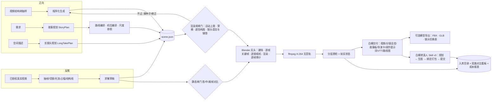
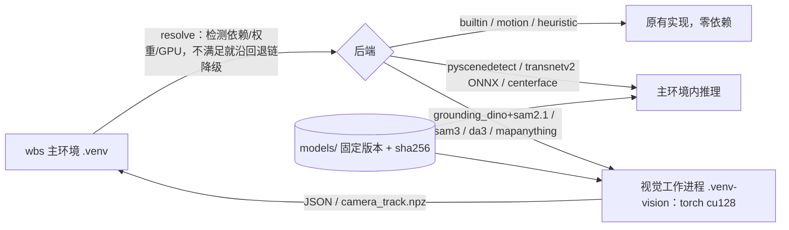

# 架构

whitebox-studio 是一个可批量运行、可断点续跑、状态可追溯的本地白模生产平台。核心约定只有一条：**`scene.json` 是唯一数据源**——正向、反推都先产出它，
Blender 建场、质检、文本产物都只读它，不硬编码任何几何或镜头。

## 总览

## 模块

| 路径 | 职责 |
|---|---|
| `src/wbs/config.py` | 分层配置（default → local → WBS_CONFIG → 环境变量） |
| `src/wbs/layout.py` | 工作区与任务目录约定（所有阶段依赖的磁盘契约） |
| `src/wbs/ledger.py`、`pipeline.py` | SQLite 台账：运行记录、步骤状态（按输入哈希幂等跳过）、模型用量、人工复核 |
| `src/wbs/providers/` | 模型适配：mock（默认）、OpenAI 兼容网关、视频手工导出 / 通用 HTTP；付费确认、dry-run、预算闸门 |
| `src/wbs/prompts.py` + `prompts/` | 带版本与出处的提示词库（原文 verbatim + Jinja2 模板） |
| `src/wbs/taxonomy.py` + `taxonomy/` | 视频结构树与带约束的可复现抽样 |
| `src/wbs/camera_language.py` + `taxonomy/camera_language.yaml` | 景别、角度、运镜词表（运镜对应 CameraBench），分镜、导演卡、语法检查与提示词共用 |
| `src/wbs/models/` + `schemas/` | 数据契约：SceneSpec、StoryPlan、LongTakePlan（JSON Schema 导出） |
| `src/wbs/forward/` | 程序化生成（7 类环境、11 种运镜）、故事规划、长镜头规划、文本产物、批次清单；`motion.py` 路线编译（按主体种类的运动上限）、`rigs.py` 机位编译、`dressing.py` 尺度参照 |
| `src/wbs/blender/` | `kinematics.py`（纯 Python，Blender 与质检共用）、`build.py`、`audit.py`、`render_ops.py`、`entry.py` |
| `src/wbs/render.py` | Blender 编排、编码、故事板、分镜总览、文本产物 |
| `src/wbs/reverse/` | 反推：解码、切镜、光流、占幅、结构线、视觉标注、求解、修正、在线转换包 |
| `src/wbs/qc/` | 渲染前闸门（`pregate.py`：动态闸门、`visibility.py` 遮挡感知构图与铺垫可读性、`grammar.py` 镜头语法与节奏）、静态闸门、媒体/剪辑/景别/速度/朝向/构建一致性/多样性、体验报告、人工复核、批次收尾 |
| `src/wbs/export.py` + `blender/model_export.py` | 模型导出：FBX（米制、逐帧烘焙）、GLB（整场一段动画）、镜头切换表 |
| `src/wbs/v2v/` | Skill v3 执行器：契约校验、规划、取帧与生图（调用原样收录的 `prepare_image_inputs.py`）、打包与提交 |
| `src/wbs/orchestrate.py` | 批量编排：线程池 + 台账续跑 + 单条失败隔离 |
| `src/wbs/registry.py` | 入库目录（SQLite/CSV/JSON）与静态看板 |
| `src/wbs/cli.py` | `wbs` 命令行 |
| `src/wbs/vision/` | 可选视觉后端：能力检测与回退链、模型登记（固定版本 + sha256）、下载器、视觉工作进程客户端、TransNetV2 / CenterFace 推理 |
| `src/wbs/control_passes.py` + `blender/passes.py` | 深度 / 分割 / 边缘控制通道（供可选 V2V 后端） |
| `skills/` | 4 个 agent skill（3 个平台编写 + Skill v3 原样） |

## 可选视觉后端（默认关闭）

- 回退链：切镜 transnetv2 → pyscenedetect → builtin；主体 sam3 → grounding_dino → motion；几何 mapanything → da3 → heuristic；
  实际使用的后端和跳过原因写进 `analysis.json`（`cuts.detector`、`subject_detection`）与 `job.json`（`solver`）。
- 重依赖（torch、transformers、DA3）只装在独立的 `.venv-vision`，主环境用子进程调用 `vision/worker_main.py`，二者只交换文件；
  工作进程失败、超时或缺模型时，调用方回退到原有实现。
- 几何求解（`reverse/geometry.py`）输入统一的相机轨迹 NPZ（OpenCV 约定、相机到世界）：DA3 / MapAnything 由工作进程产出，
  MegaSaM / COLMAP 结果可直接导入。重力由深度里的地面平面（RANSAC + 收缩容差精修）确定，尺度来自假定机高或米制深度。

## 关键设计

- **同一套运动学**：`kinematics.SceneEvaluator` 同时被 Blender（逐帧打关键帧）和 Python 质检（48/96Hz 采样）调用；
  时间映射、响应层和停顿保持朝向算法移植自参考 whitebox-world-studio 1.2.0。Blender 实测位置与 scene.json 计算偏差
  每条都写进 `reports/构建一致性.json`（实测约 7e-5 m）。
- **逐帧关键帧**：主体根节点与每镜相机每帧一个关键帧，插值方式不影响结果；不触碰 Blender 5 分层动作的 `action.fcurves`。
- **两道闸门**：渲染前闸门——动态闸门（numpy 向量化，相机/主体/体块/主体间逐 1/48 秒采样；按主体种类的速度、加速、制动、
  过弯、转向上限）＋遮挡感知构图预检（镜头主体在画内且至少三分之一未被体块挡住的帧 ≥90%）＋镜头语法、节奏与铺垫可读性报告
  （默认只警告）；反推专用静态闸门（最终相机首/中/尾帧对比）。
- **编译代替手摆**：故事规划写路线（途经点、到达时刻、停留）和机位意图（rig），平台按运动上限、景别与焦距编译成关键帧并避让体块；
  做不到时给出具体原因，进入规划链的逐层修正与评审回路。
- **切点以实际渲染为准**：审计记录 Blender 每帧实际激活的相机，剪辑检查据此核对切点；画面切点检测只作辅助证据。
- **幂等与续跑**：每步以输入哈希记账，成功且输入未变就跳过；V2V 生图以 `job_id + image_id` 为键，成功的图不再请求。
- **如实状态**：technical 由程序判定；sampled_visual / normal_speed_viewing / curation 只能由人工 `wbs review mark` 设置。
- **默认零外部调用**：所有模型默认 mock，视频提交默认只导出；真实调用需确认、先 dry-run、受预算上限约束。
